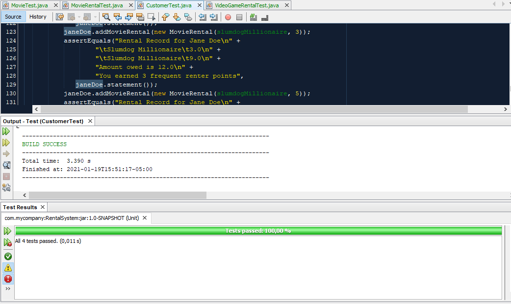
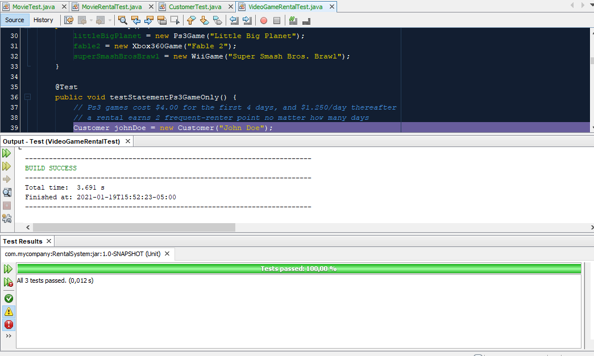
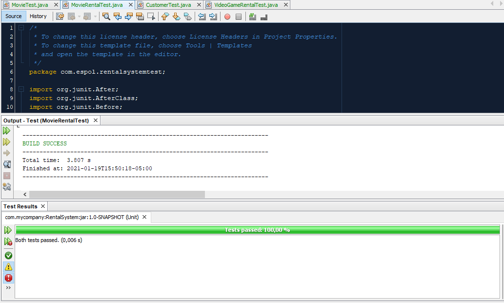

# Test
Taller de Test

Se deben crear las pruebas unitarias para las clases Customer, Movie, MovieRental y VideoGameRental.

# MovieTest

# CustomerTest

# VideoGameRentalTest

# MovieRentalTest

